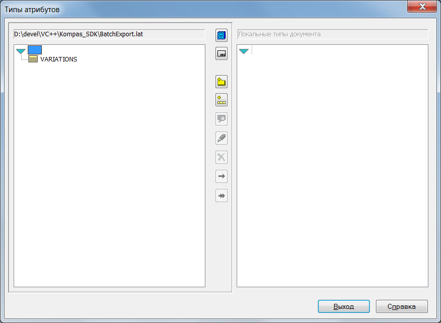
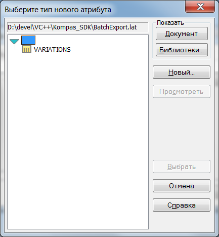
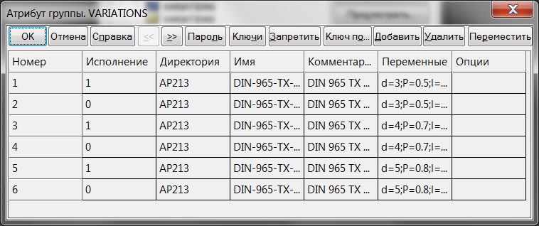
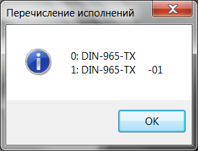
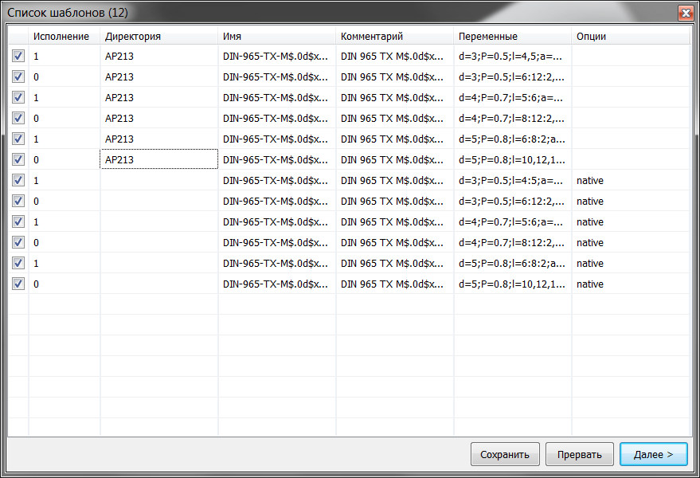
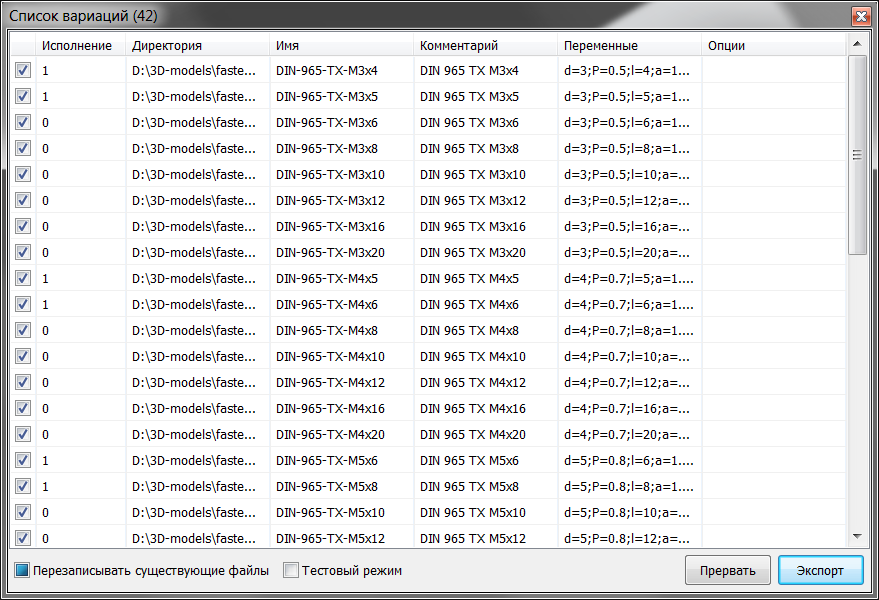
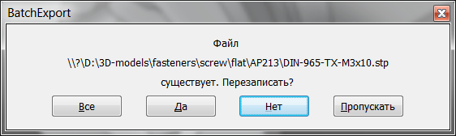
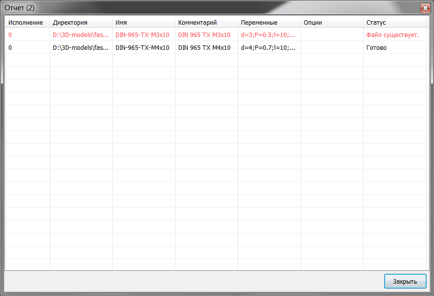

# BatchExport

Библиотека позволяет выполнять пакетное перестроение 3D модели по заданным параметрам
и экспортирование в различные форматы (на данный момент поддерживаются нативные
форматы Компас 3D (.m3d для деталей и .a3d для сборок) и STEP).

Параметры для работы библиотеки хранятся в атрибутах модели (табличный атрибут).
Библиотека типов атрибутов содержится в файле BatchExport.lat, поставляемого с BachExport.
Подключение библиотеки типов выполняется через диалог "Типы атрибутов"
("Сервис - Библиотеки стилей, типов, оформлений и основных надписей - Типы атрибутов"),



либо через выбор библиотеки шаблонов (кнопка "Библиотеки...") при добавлении нового атрибута.



*Десятичный разделитель всех вещественных значений - "." (точка, по умолчанию в "C" локали)*

## Поля атрибута



**Номер**  
Номер записи атрибута. Индексируется автоматически. Библиотекой не используется.

**Исполнение**  
Целочисленное поле. Индекс исполнения, который можно узнать вызвав утилиту "Перечисление исполнений".  



**Директория**  
Строковое поле. Абсолютный или относительный путь до целевой директории.
Относительные пути считаются от директории исходного файла. Поддерживаются лексемы переменных, описанные ниже.
Недопустимые символы в результирующем пути заменяются на символ подчеркивания.

**Имя**  
Строковое поле. Указывается полное имя модели. Поддерживаются лексемы переменных, описанные ниже.

**Комментарий**  
Строковое поле. Дополнительный комментарий (добавляется к существующему).
Поддерживаются лексемы переменных, описанные ниже.
Также поддерживаются стандартные эскейп-последовательности \a, \b, \f, \n, \r, \t, \v, \xhh and \uhhhh

**Переменные**  
Строковое поле. Список изменяемых для данной вариации переменных.
Не указанные в этом поле переменные остаются без изменений, следует это учитывать при составлении полей
последующих атрибутов. Имена переменных в системе Компас 3D регистрозависимые.  
Синтаксис:  
```
<имя переменной1>[опции переменной1]=<значение1|диапазон1|"выражение1">[,значение1|диапазон1|"выражение1"]...[;переменная2]...
	имя переменной должно состоять из букв латинского алфавита, цифр или знака _. Не должно начинаться с цифры.
	опции переменной:
		|	локальная переменная. По умолчанию изменяется переменная главного исполнения, при указании этой опции изменяется
			переменная в исполнении, указанном в поле "Исполнение".
	значение	вещественное число как значение переменной.
	диапазон	указывается как <вещественное число начала диапазона>:<вещественное число конца диапазона включительно>[:шаг].
				По умолчанию шаг равен 1.0. Поддерживается обратный счет от большего к меньшему.
	выражение	Допустимое системой математическое выражение, напр. a*2. Должно быть заключено в парные кавычки.
```
Вариации создаются на основе списка переменных, в порядке следования переменных в списке.

**Опции**  
Строковое регистроНЕзависимое поле. В этом поле указываются целевой формат, а также опции шаблона вариаций. Имена опций могут быть сокращены.  
Разделитель опций: **, : ; [space] [tab]**.  
```
Список форматов:
      native	Нативный формат Компас 3D. .m3d для деталей, .a3d для сборок.
       ap203	Формат STEP AP203 (по умолчанию), расширение файла .stp
         stl	Формат STL, расширение файла .stl
        vrml	Формат VRML, расширение файла .wrl

Список опций:
    included	Включить шаблон (по умолчанию).
    excluded	Исключить шаблон. Может быть в последствии включен в диалоге пакетного экспорта.
   [no]dcdir	Отложеная обработка лексем в поле директории.
				При включеной опции, лексемы обрабатываются после успешного перестроения модели и
				актуализации выражений в переменных.
				Предпросмотр результирующего текста недоступен.
  [no]dcname	Отложеная обработка лексем в поле имени.
  [no]dccomm	Отложеная обработка лексем в поле комментария.
```

## Лексемы переменных
В текстовых полях (за исключением поля переменных) поддерживаются лексемы вида: 

```
$[формат[,]]<имя переменной>$	текущее значение переменной. 
	формат в виде стандартного форматирования printf.
	Поддерживаемые спецификаторы типа:
		вещественные типы: **g** G f F e E
		целочисленные типы: d i u x X (значение приводится к int64_t или uint64_t)
	Если формат не указан, используется спецификатор %g.
	Если переменная содержит выражение и опция отложеной обработки для поля **выкл**ючена,
	выражение будет добавлено в текстовом виде и формат, если указан, должен соответствовать
	спецификатору %s.
	Примеры: (v=2.5)
		$%+.2f,v$	=> +2.50
		$%dv$		=> 2
		$%02X, v$	=> 02

$@E[индекс][.тип]$	обозначение исполнения по индексу. Если индекс не указан, используется индекс,
					указанный в поле Исполнение.
	Тип должен быть из перечисления ksVariantMarkingTypeEnum SDK, если не указан: -1 (ksVMFullMarking).
		ksVMFullMarking			-1	Полное обозначение
		ksVMBaseMarking			0x1	Базовая часть обозначения
		ksVMEmbodimentNumber	0x2	Исполнение
		ksVMAdditionalNumber	0x4	Дополнительный номер
		ksVMCode				0x8	Код документа
	Возможно объединение типов с помощью символа "|".

$@F<индекс>$		Имя элемента используемого исполнения по его индексу.
					Список элементов можно получить с помощью утилиты "Перечисление элементов"  

$@N[индекс]$		Имя исполнения по индексу. Если индекс не указан - используется индекс из поля Исполнение.

$@V<имя_переменной>	Значение переменной среды.

$@(D|T)<формат>$	Форматированная строка даты/времени.
					Если опция отложеной обработки ВЫКЛючена, будет использована дата/время обработки аттрибутов
					документа (до вывода списка вариаций),
					при ВКЛюченой опции будет использована дата/время непосредственного перестроения документа
					в соответствии с параметрами вариации.
					Формат соответствует спецификации strftime(). Длина результирующей строки ограничена 127 символами.
					Если в результате форматирования strftime() вернет 0 (в т.ч. из-за превышения вышеуказанной длины строки),
					композиция поля будет прервана с ошибкой.

$@L$				Имя файла без расширения

$$					символ $.
```
**Максимальная длина текстовых полей - 256 символов (ограничение API).**

## Работа с утилитой экспорта


Если при запуске утилиты экспорта был зажат модификатор Ctrl, производится "быстрый" экспорт
с минимумом взаимодействия с пользователем.
После запуска утилиты в нормальном режиме откроется окно со списком всех найденых в атрибутах документа
шаблонов. При необходимости можно включать/исключить элементы щелчком по флажку в первой колонке.
Также можно включить или исключить множество элементов списка щелчком по заголовку первой колонки.
Если при этом удерживать клавишу Shift - производится инвертирование выбора.
Если в списке выделено более одной строки, операция выбора выполняется только с выделеными строками,
иначе со всем списком.
В диалоге списка шаблонов можно изменять поля каждого шаблона двойным кликом по ячейке или клавишей F2.
После редактирования полей, изменения можно сохранить в атрибуты документа с помощью кнопки Сохранить.
Если поля шаблона не могут быть интерпретированы или указанная в них информация не соответствует модели,
обнаруженные проблемы будут перечислены в поле Статус.
С помощью сочетания клавиш Ctrl+Ins можно скопировать список всех элементов в буфер обмена.

Чтобы начать построение вариаций необходимо нажать кнопку Далее >.



После построения вариаций откроется диалоговое окно со списком полученных вариаций.
Если в процессе построения вариаций произошли ошибки, они будут отображены в поле Статус.
В окне списка вариаций также можно включать/исключать элементы списка.
Для указания следует ли перезаписывать существующие файлы служит соответствующий флажок внизу окна.
Неопределенное состояние флажка (по умолчанию) приведет к выводу диалога о перезаписи существующего файла,
если такововой файл будет встречен при выполнении экспорта.



Установленный флажок Тестовый режим запрещает утилите производить файловые операции (создание директорий, запись файлов).

Для начала экспорта следует нажать кнопку Экспорт
При выполнении пакетного экспортирования в строке статуса отображается текущий прогресс операции.
По завершении операции откроется окно с отчетом.
Если при выполнении операции некоторые элементы экспортировать неудалось, в поле Статус будет указана причина неудачи.



Для завершения утилиты следует нажать кнопку Закрыть.

В диалоговых окнах предусмотрена возможность копирования содержимого в буфер обмена с помощью сочетания клавиш Ctrl+Ins.

Библиотека также предоставляет возможность экспорта и импорта шаблонов в/из CSV файла.
